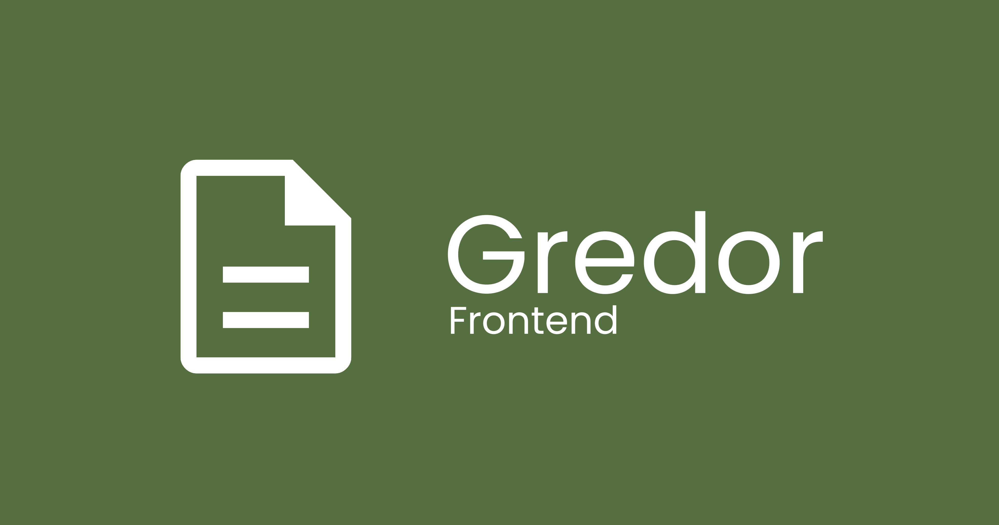

Gredor är ett kostnadsfritt webbaserat verktyg för att ta fram årsredovisningar
och skicka in dem till Bolagsverket i iXBRL-format. Verktyget har stöd för alla
delar i en vanlig K2-årsredovisning för aktiebolag utan revisor.

Frontenden är Vue-baserad och byggd för att kunna köras i en nginx-container.
Testning görs med hjälp av Cypress.

Applikationen är lite speciell på så sätt att frontenden innehåller i princip
all logik, och backenden används i princip bara för att kommunicera med
Bolagsverket och BankID. Detta för att utnyttja faktumet att iXBRL kan
integreras i XHTML och därmed byggas upp i webbläsaren med
live-förhandsgranskning.


## Köra Gredor-frontenden lokalt

### Förberedelser första gången

1. Gör en kopia av `.env.template` i rotmappen; kalla den för `.env.development`
2. Fyll i värden i `.env.development` (kör du `gredor-backend` med
   standardinställningar kan du ta `http://localhost:8080` som backend-URL)

### Starta server för live-utveckling

Kör:

```sh
npm run start:development
```


## Bygga Gredor-frontenden

Kör:

```sh
npm run build
```


## Vill du bidra?

Bidrag till projektet uppskattas stort! Dock är det viktigt att tänka på att
t.ex. nya funktioner och förändringar måste passa bra med Gredor i övrigt. Om du
vill bidra med något större, öppna gärna en issue och/eller utkasts-PR för att
få tidig återkoppling på dina tänkta ändringar.


## Licens

Gredor distribueras under AGPLv3-licens, med en tilläggsklausul för friare
sammansättning med annan programvara.
